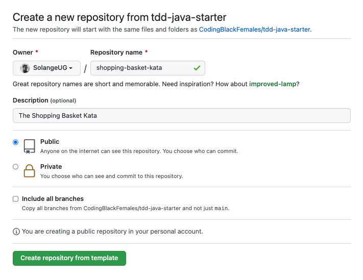

# Java Starter

[][1]
[][2]
[][3]
[][4]

A kata starter project (skeleton) to practice test-driven development.

This short guide describes:

- [Tools you'll need to get started][10]
- [How to use this repository template][11]
- [How to set up your local kata project][12]
- [How to get started with your kata][13]

## Prerequisites

This starter project uses the [Java][1] programming language.

Before getting started, ensure you have Java 17 LTS (or higher) installed locally. The following commands should output the version of Java installed.

```bash
$ javac -version

javac 17.0.4
```


```bash
$ java -version

openjdk version "17.0.4" 2022-07-19 LTS
OpenJDK Runtime Environment Zulu17.36+13-CA (build 17.0.4+8-LTS)
OpenJDK 64-Bit Server VM Zulu17.36+13-CA (build 17.0.4+8-LTS, mixed mode, sharing)
```

<br/>

If you do not have Java installed, a few options are available:

#### <u>Oracle</u>

Follow the JDK installation guide on the [Oracle website][5].

#### <u>SdkMan</u>

If you are using a Unix based system, we recommend using the [SdkMan tool][6] for managing software development kits.
Once the SdkMan tool [installed][7], follow the instructions on [this page][8] to install the JDK 17.


## Installation

To use this starter project:

- Click on the [`Use this template` button][9]
- Fill out the details of your new project
- Then click on `Create repository from template`



## Development

#### <u>Clone your repository</u>

Once your new repository created, clone it locally:
- replace `${your-username}` with your GitHub username
- replace `${repository-name}` with the repository name you created above

```bash
git clone git@github.com:${your-username}/${repository-name}.git
cd ${repository-name}
```

#### <u>Install dependencies</u>

Next, install the project dependencies and validate your project by running the following command at the root of your project:

```bash
./mvnw clean validate
```

If you are on a Windows machine, that will be:

```bash
mvnw clean validate
```

You should see the following console output:

```bash
$ ./mvnw clean validate

[INFO] Scanning for projects...
[INFO] 
[INFO] --------------< com.codingblackfemales:shopping-basket-kata >---------------
[INFO] Building shopping-basket-kata 1.0.0
[INFO] --------------------------------[ jar ]---------------------------------
[INFO] 
[INFO] --- maven-clean-plugin:3.2.0:clean (default-clean) @ shopping-basket-kata ---
[INFO] ------------------------------------------------------------------------
[INFO] BUILD SUCCESS
[INFO] ------------------------------------------------------------------------
[INFO] Total time:  0.155 s
[INFO] Finished at: 2022-09-14T00:43:32+01:00
[INFO] ------------------------------------------------------------------------

```

#### <u>Example</u>

In my case, the above steps would look like the following:

```bash
git clone git@github.com:SolangeUG/shopping-basket-kata.git
cd shopping-basket-kata
./mvnw clean validate
```

## Next steps

Once the project setup completed:
- update the description of your repository to match that of the kata
- update the `artifactId`, and the project `name` in the `pom.xml` file to match the name of the kata
- execute the following command to run tests

```bash
./mvnw clean test
```

Enjoy working on your kata! :smiley:


[1]: https://www.java.com/en/download/help/whatis_java.html
[2]: https://www.ibm.com/cloud/blog/jvm-vs-jre-vs-jdk
[3]: https://junit.org/junit5/
[4]: https://maven.apache.org/
[5]: https://www.oracle.com/java/technologies/downloads/#jdk17
[6]: https://sdkman.io
[7]: https://sdkman.io/install
[8]: https://sdkman.io/jdks#zulu
[9]: https://github.com/CodingBlackFemales/tdd-java-starter/generate
[10]: #prerequisites
[11]: #installation
[12]: #development
[13]: #next-steps
